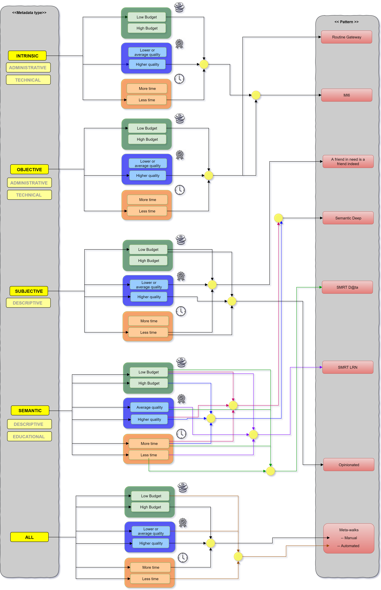
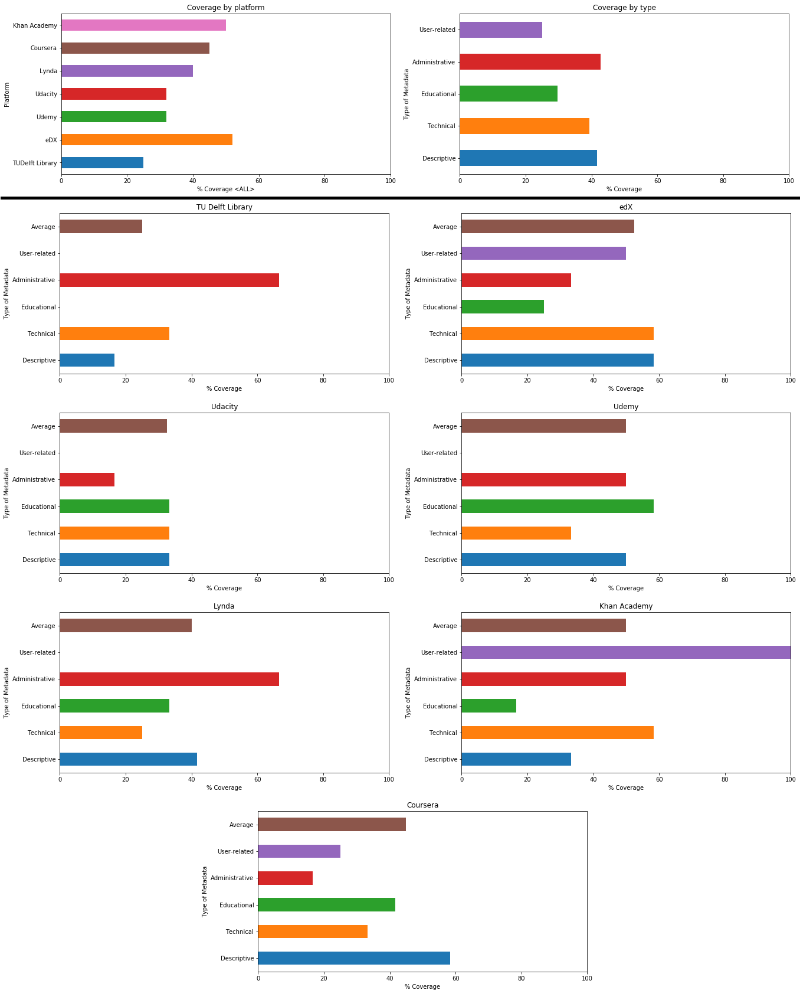

### ------------------ Metadata types ---------------------

### ------------------ Decision tree for pattern to use ---------------------

### ------------------ PATTERN 1+3 (Routine Gateway) ---------------------

### ------------------ PATTERN 2 (A friend in need is a friend indeed) ---------------------

### ------------------ PATTERN 5+8 (Semantic Deep) ---------------------

### ------------------ PATTERN 6 (Opinionated) ---------------------

### ------------------ PATTERN 7 (SMRT LRN) ---------------------

### ------------------ PATTERN 9+10 (SMRT D@ta) ---------------------

### ------------------ PATTERN 11 (MI6-007) ---------------------

### ------------------ PATTERN 12 (Meta-walk) ---------------------

## ------------------ Metadata coverage stats: ---------------------
